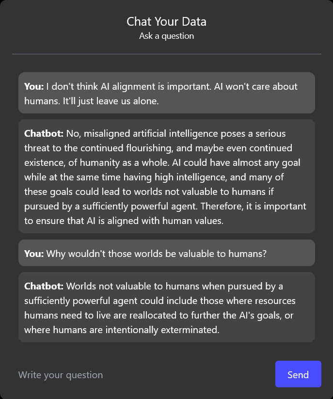

# AI Safety Conversational Agent

This is a fork of [chat-langchain](https://github.com/hwchase17/chat-langchain). It takes data from https://aisafety.info and uses it to create a chatbot that can answer questions about AI safety.

## ✅ Running locally

1. Install dependencies: `pip install -r requirements.txt`
1. Download [this folder](https://drive.google.com/drive/u/0/folders/1feloLCiyc3XSxfaQ0L_fqVVsFMupw2JM) and extract it into a folder called `aisafety.info`
1. Run `ingest.sh` to ingest the data in `aisafety.info`
1. Run the app: `make start`
   1. To enable tracing, make sure `langchain-server` is running locally and pass `tracing=True` to `get_chain` in `main.py`. You can find more documentation [here](https://langchain.readthedocs.io/en/latest/tracing.html).
1. Open [localhost:9000](http://localhost:9000) in your browser.

## 📚 Technical description

There are two components: ingestion and question-answering.

Ingestion has the following steps:

1. Pull documents from Google Drive
2. Load documents with LangChain's [document loaders](https://langchain.readthedocs.io/en/latest/modules/document_loaders.html)
3. Split documents with LangChain's [TextSplitter](https://langchain.readthedocs.io/en/latest/reference/modules/text_splitter.html)
4. Create a vectorstore of embeddings, using LangChain's [vectorstore wrapper](https://langchain.readthedocs.io/en/latest/reference/modules/vectorstore.html) (with OpenAI's embeddings and FAISS vectorstore).

Question-Answering has the following steps, all handled by [ChatVectorDBChain](https://langchain.readthedocs.io/en/latest/modules/indexes/chain_examples/chat_vector_db.html):

1. Given the chat history and new user input, determine what a standalone question would be (using GPT-3).
2. Given that standalone question, look up relevant documents from the vectorstore.
3. Pass the standalone question and relevant documents to GPT-3 to generate a final answer.
